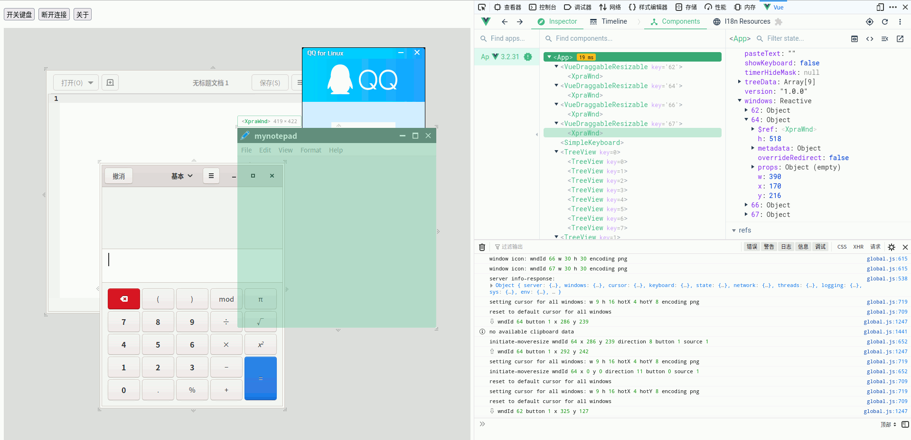

# Xpra-html-vue

Brings [xpra-html5](https://github.com/Xpra-org/xpra-html5) to Vue.js (Vue3 + Webpack 5), and throw away those old stuffs (jQuery ...).

Benefits:

- Modern Javascript syntax
- Modern browser function (WebCodecs, Media Source Extensions, OffscreenCanvas, ...)
- Never reinventing the wheel
- Easily comprehensible
- Easily maintaining and extending
- Easily integrated with other system

Compatibility:

- **This project has been tested on Xpra server version v4.3.2, and may not work on previous version.**
- Tested on Firefox (99.0.1), Chrome (99.0.4). IE is not supported at all and you know why.

Working in progress:

- Modal dialogs
- Printing
- Scale
- File transfer
- Connection settings
- Auto reconnect

Some details you may care about:

- `bencode` is removed because it does not distinguish bytes and strings.
- `rencodelegacy` is removed because of bad performance.
- `packet_encoder` is immutable because only `rencodeplus` is supported.
- Only support parsing protocol data in Web Worker mode
- Only support painting in `decode_worker` mode
- Bug report is removed
- Floating menu is removed
- Broadway decoder is removed
- Aurora decoder is removed
- `clipboard_targets` only support plain text to reduce the complexity
- `clipboard.selections` removed `PRIMARY`
- Invisible pasteboard is removed

Known bugs (xpra-html5 also has these problems):

- Unable to fetch clipboard data from server (but pushing works fine)
- Unable to type accents (éèêëẽ)
- Unable to use IME (Input Method)
- Unable to copy-cut-paste non-ascii characters

Only xpra-html5-vue have these problems:

- Unable to use authentication/encryption
- Incorrect position of override-redirect windows (seems the server sent wrong `x,y` value)

Only xpra-html5 have these problems:

- Maximize a window and refresh the tab, then unable to restore the maximized window (stored original size is discarded)

If you know how to fix them, don't hesitate to submit your PRs! :)

## Usage

- Install Node.js, Yarn, and [Xpra server](https://github.com/Xpra-org/xpra)
- `xpra start --start=gnome-calculator --daemon=no --bind-tcp=0.0.0.0:10000`
- `yarn serve`
- `xdg-open http://localhost:8899`
